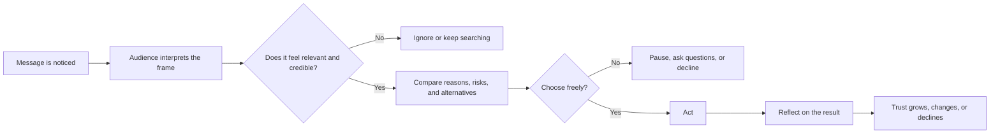

# Chapter 1: Persuasion and Human Decision-Making

Persuasion is part of almost every designed message. A package asks us to choose one product. A poster asks us to notice an event. A website asks us to trust an organization and take the next step. Understanding persuasion helps designers make those moments clearer, more useful, and more responsible.

## What Is Persuasion?

Persuasion is the process of shaping someone's attention, interpretation, trust, or action through communication. It can use words, images, layout, sound, timing, evidence, or social context. Persuasion does not guarantee a result. It creates conditions in which a person may understand an idea, form an opinion, or choose to act.

A useful way to think about the process is:

1. **Attention:** What does the person notice?
2. **Interpretation:** What meaning do they make from it?
3. **Trust:** What makes the message seem credible or relevant?
4. **Action:** What choice becomes easier or more appealing?

Good persuasion respects the audience as a decision-maker. It gives people a fair chance to understand the offer, compare alternatives, and decline. It can still be vivid and emotionally engaging, but it does not depend on confusion or pressure.

## Persuasion Is Not Manipulation

Persuasion and manipulation can look similar because both try to influence a decision. The ethical difference is often found in the method and the relationship between the communicator and the audience.

- **Persuasion** presents reasons, evidence, emotion, or an invitation in a way that leaves meaningful choice with the other person.
- **Manipulation** hides important information, exploits a vulnerability, creates a misleading impression, or pressures someone toward an outcome they would not reasonably choose with a clearer understanding.
- **Coercion** goes further by using threats, punishment, or force so that refusing is not a genuinely available option.

| Approach | How it influences people | Is meaningful choice preserved? | Example |
| --- | --- | --- | --- |
| Persuasion | Presents reasons, evidence, emotion, or an invitation to shape understanding and action. | Yes. The audience can understand the offer, consider alternatives, and decline. | A shirt page explains the fabric, price, and return policy, then invites the shopper to decide. |
| Manipulation | Hides relevant information, exploits vulnerability, or creates a misleading impression. | Not fully. The person may technically say no, but the message interferes with informed judgment. | A clothing ad shows only flattering reviews while hiding repeated complaints about poor durability. |
| Coercion | Uses threats, punishment, force, or an unacceptable consequence to compel action. | No. Refusing is not a genuinely available option. | A supervisor threatens an employee's job unless they buy the company's product. |

The same technique can be used ethically or unethically. A limited-edition product may genuinely have a small production run. Claiming that an ordinary product is "almost gone" just to create panic is deceptive. A customer review can help people judge quality. Selecting only unusually positive reviews while hiding important problems can distort their judgment.

Intent matters, but it is not enough. A designer should also ask what the audience can reasonably understand, what information is being left out, and who bears the cost if the decision goes badly.

## Cialdini's Principles of Influence

Robert Cialdini's work describes recurring principles that can affect how people respond to a request or message. These principles are not magic buttons. They are patterns that help explain why a message may feel credible, familiar, urgent, or personally relevant.

- **Reciprocity:** People often feel inclined to return a benefit or favor. A useful sample, guide, or honest service can begin a relationship. The ethical boundary is making the gift conditional on an unwanted commitment or making the audience feel trapped by it.
- **Commitment and consistency:** After people make a choice or state a position, they often prefer actions that fit it. A clear, voluntary first step can support a larger goal. Misuse involves pushing someone into a trivial commitment and then treating it as permission for something much more significant.
- **Social proof:** People look to the behavior or experiences of others, especially when a situation is uncertain. Accurate reviews, participation numbers, or relevant examples can reduce uncertainty. Fake testimonials, bought popularity, and irrelevant popularity signals undermine informed choice.
- **Liking:** People are more open to messages from people, organizations, or styles they like or identify with. Familiarity and shared values can make communication warmer. Using friendliness to conceal a poor offer or targeting someone through manufactured intimacy is manipulative.
- **Authority:** Expertise, credentials, and trustworthy evidence can help people evaluate a complex claim. Authority should be relevant and verifiable. A famous person, impressive title, or lab-like visual should not substitute for evidence they do not possess.
- **Scarcity:** Items that are genuinely limited in quantity or availability can seem more valuable. Honest deadlines and accurate inventory information help people make timely decisions. False countdowns and invented shortages manufacture pressure.
- **Unity:** People are influenced by a sense of shared identity or belonging, such as a community, place, practice, or group. Inclusive identity can make a message meaningful. Excluding, stereotyping, or implying that someone is less worthy unless they buy is harmful.

These principles often work together. For example, a local clothing brand might show real customer photographs (social proof), explain its small production run (scarcity), and invite people into a repair community (unity). The combination is responsible only if each claim is true and the audience remains free to decide.

## More Tools for Understanding Decisions

### Framing

Framing is the way a choice is presented. The facts may remain the same while the emphasis changes. A price can be described as "$20 for a shirt" or "$20 for a shirt designed for repeated wear." The second frame draws attention to durability and use, but it should be supported by real information about the shirt. Framing becomes misleading when it highlights a favorable interpretation while hiding a fact that would reasonably change the decision.

### Defaults and Friction

A **default** is what happens when a person does nothing. **Friction** is anything that makes an action harder, such as extra steps, unclear instructions, or a difficult-to-find cancellation button. Designers can use defaults and friction to support beneficial choices: for example, making privacy settings easy to understand or making a return process straightforward. They can also use them to trap people into subscriptions or make refusal exhausting. A useful test is whether saying no is as understandable and practical as saying yes.

### Rhetorical Appeals

Classical rhetoric often describes three kinds of appeal:

- **Ethos:** the credibility and character of the speaker or organization
- **Pathos:** the emotions the message engages
- **Logos:** the reasoning and evidence supporting its claim

Strong communication usually balances all three. A climate organization might establish expertise through transparent data (ethos and logos) while showing the human consequences of a decision (pathos). Emotion is not automatically irrational, and data is not automatically honest; both need context.

## A Simple Decision Journey

The diagram below shows one possible journey. Real decisions can move backward, skip stages, or be influenced by several messages at once.

At each stage, design can help or interfere. A strong headline may win attention, but it cannot make a weak claim true. Clear evidence can support trust, but it cannot remove every risk. Ethical persuasion improves the quality of the decision, not just the likelihood of a sale.

## The Plain White T-Shirt Example

Imagine the same plain white T-shirt: cotton jersey, short sleeves, and no visible logo. The physical product has not changed, but its meaning can change through persuasion and design.

- **Practical frame:** "A reliable everyday layer." The message emphasizes fit, fabric details, wash instructions, and value.
- **Ethical frame:** "A lower-waste choice for a smaller wardrobe." This frame could discuss durability and repair, but it must not claim environmental benefits without evidence.
- **Community frame:** "The shirt worn by our neighborhood makers." Real photographs and stories could create unity and social proof without pretending that every customer belongs to the same group.
- **Urgency frame:** "Available in this first production run." This is persuasive only if the run is actually limited and the statement remains true.

The shirt stays the same. Attention, interpretation, trust, and action change because the message changes. That is precisely why designers need to examine not only what they are selling, but also what meaning they are asking people to attach to it.

## Questions to Ask Before Trying to Persuade

1. What do I want the audience to understand, feel, or do?
2. Is the claim accurate, specific, and supported by information the audience can check?
3. What important limitation, cost, or alternative might the audience need to know?
4. Am I helping people choose, or making it difficult for them to refuse?
5. Which audience vulnerability, identity, or uncertainty could this message exploit?
6. Does the design give the audience enough time and clarity for the decision?
7. Would I consider the method fair if I were the person receiving it?
8. What evidence would change my own recommendation?

## Explore Further

To investigate these ideas, search for:

- Robert Cialdini principles of influence and ethical persuasion
- framing effect and behavioral economics
- default effects and dark patterns in interface design
- ethos pathos logos in rhetoric
- informed consent and persuasive communication

When researching, compare explanations from reputable academic, professional, or educational sources. Check whether a claim describes evidence, an interpretation, or a marketing slogan.

## What You Should Remember

Persuasion shapes attention, meaning, trust, and action. It is different from manipulation because ethical persuasion protects meaningful choice, uses truthful claims, and respects the audience. Cialdini's principles, framing, defaults, friction, and rhetorical appeals help explain why messages work. The same white T-shirt can acquire different meanings through its presentation, but changing the frame does not excuse hiding facts or manufacturing pressure. The designer's responsibility is not only to make a message effective, but also to make the resulting decision more informed and more free.
